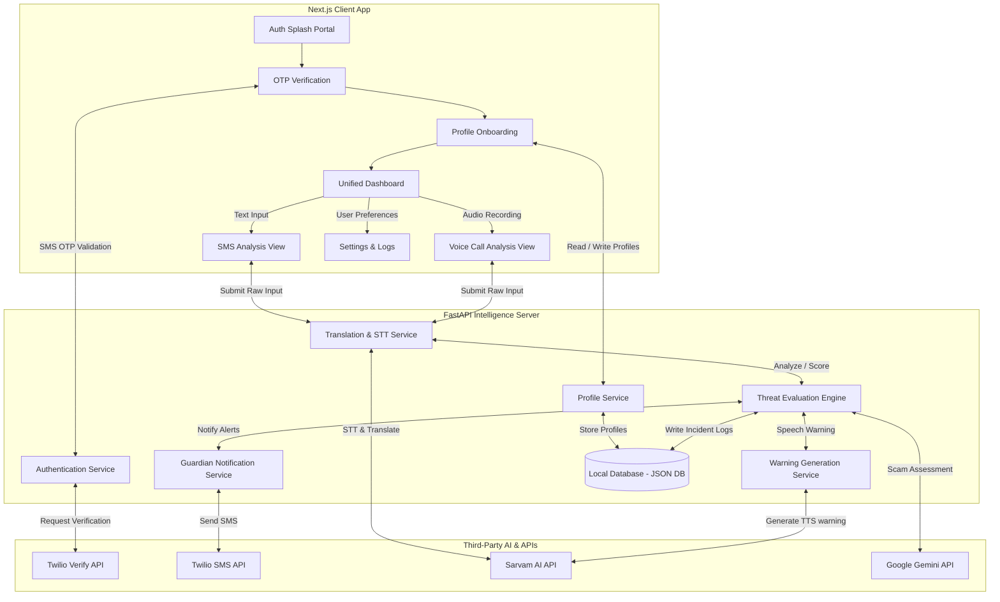
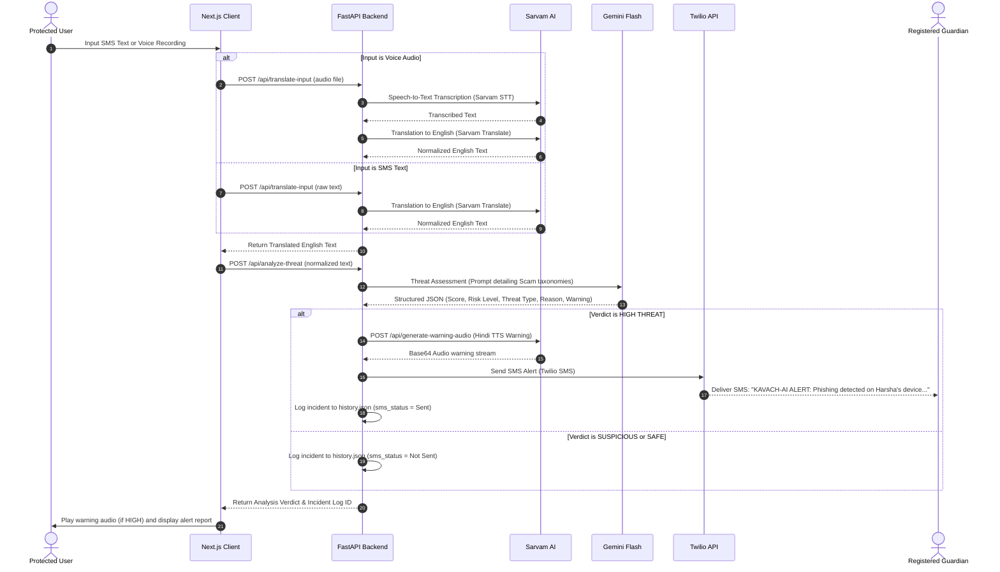

# Architecture Specifications - Kavach-AI

This document details the engineering architecture, data pipelines, API integrations, and internal threat assessment logic powering **Kavach-AI**.

---

## 🏗️ System Architecture Overview

Kavach-AI is built on a client-server architecture. The frontend handles authentication, onboarding, audio recording, and visual status dashboards. The backend acts as the fraud intelligence engine, orchestrating interactions with external AI models and communication endpoints.



---

## 🧠 AI Pipeline & Threat Detection Workflow

The core pipeline processes raw inputs, normalizes them, assesses threats, and executes mitigation steps:



---

## 📡 API Flow & Data Contracts

### 1. Verification & Authentication Flow

#### Send OTP
* **Endpoint**: `POST /api/auth/send-otp`
* **Request Payload**:
  ```json
  {
    "phone_number": "+916301929637"
  }
  ```
* **Response**:
  ```json
  {
    "otp_sent": true
  }
  ```

#### Verify OTP
* **Endpoint**: `POST /api/auth/verify-otp`
* **Request Payload**:
  ```json
  {
    "phone_number": "+916301929637",
    "otp_code": "123456"
  }
  ```
* **Response**:
  ```json
  {
    "verified": true
  }
  ```

---

### 2. Profile Management Flow

#### Save/Update Profile
* **Endpoint**: `POST /api/profile`
* **Request Payload**:
  ```json
  {
    "phone_number": "+916301929637",
    "protected_name": "Harsha",
    "guardian_number": "+919346694088",
    "preferred_language": "te-IN",
    "notify_high": true,
    "notify_suspicious": true,
    "profile_completed": true
  }
  ```
* **Response**:
  ```json
  {
    "status": "success",
    "message": "Profile saved successfully."
  }
  ```

#### Fetch Profile
* **Endpoint**: `GET /api/profile?phone_number=+916301929637`
* **Response**:
  ```json
  {
    "phone_number": "+916301929637",
    "protected_name": "Harsha",
    "guardian_number": "+919346694088",
    "preferred_language": "te-IN",
    "notify_high": true,
    "notify_suspicious": true,
    "profile_completed": true
  }
  ```

---

### 3. Incident Scan & Analysis Flow

#### Step 1: Input Normalization (Translation / STT)
* **Endpoint**: `POST /api/translate-input`
* **Payload**: Form-data with optional `text` or `file` (audio WAV/MP3) and `language_code` (e.g. `hi-IN`).
* **Response**:
  ```json
  {
    "input_type": "text",
    "original_text": "प्रिय ग्राहक, आपका SBI योनो खाता ब्लॉक हो गया है...",
    "translated_text": "Dear customer, your SBI Yono account has been blocked...",
    "detected_language": "hi-IN",
    "source": "Sarvam Translate"
  }
  ```

#### Step 2: Threat Evaluation
* **Endpoint**: `POST /api/analyze-threat`
* **Request Payload**:
  ```json
  {
    "text": "Dear customer, your SBI Yono account has been blocked...",
    "input_type": "SMS",
    "guardian_enabled": true,
    "guardian_on_suspicious": false
  }
  ```
* **Response**:
  ```json
  {
    "analysis": {
      "threat_score": 95,
      "confidence_score": 98,
      "risk_level": "HIGH THREAT",
      "threat_type": "Phishing / Impersonation",
      "reason_flags": [
        "Urgent action required",
        "Impersonating financial institution",
        "Suspicious link included"
      ],
      "recommended_action": "Do not click the link. Block this contact immediately.",
      "warning_speech_text": "कृपया ध्यान दें, यह संदेश एक बैंक धोखाधड़ी का प्रयास हो सकता है। लिंक पर क्लिक न करें।"
    },
    "logged_id": "scam-1781414337234",
    "timestamp": "2026-06-14T10:52:17.234123"
  }
  ```

---

## 🛡️ Decision Engine Threat Scoring Thresholds

Gemini generates a numerical threat score from `0` to `100`. The backend and frontend categorize risk levels according to the following thresholds:

| Threat Score | Risk Level | Actions Executed |
| :---: | :--- | :--- |
| **0 - 39** | `SAFE` | Render green UI; log as legitimate transaction; no alarms. |
| **40 - 69** | `SUSPICIOUS` | Render amber UI; warn the user visually on dashboard; log history. Trigger Guardian SMS only if `notify_suspicious` is enabled. |
| **70 - 100** | `HIGH THREAT` | Render red UI with pulse animations; generate and play localized voice warnings via Sarvam TTS; dispatch Twilio Guardian alert SMS. |

---

## 📢 Guardian Alert Notification Format

When a `HIGH THREAT` incident triggers an alert, the backend sends a Twilio SMS alert containing the protected user's name and details of the scam:

```
KAVACH-AI ALERT
Potential fraud detected on protected user device.
Protected User: {user_name}
Threat Type: {scam_type}
Risk Score: {threat_score}
Please contact the protected user immediately.
```
This alert provides the guardian with context so they can contact the vulnerable user immediately and prevent financial loss.
