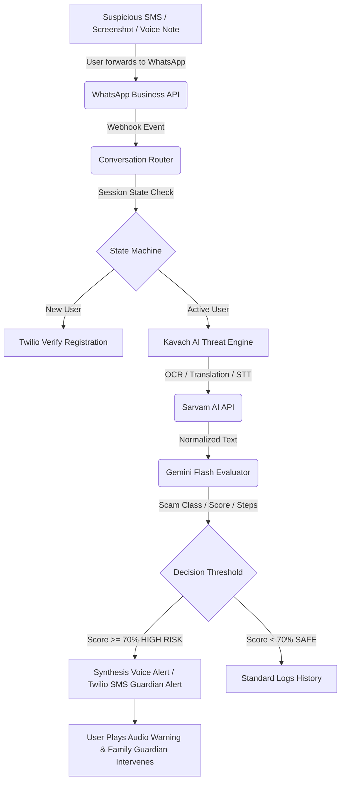

# Kavach AI – AI Fraud Protection Assistant (कवच AI)

[](LICENSE)
[](https://react.dev/)
[](https://fastapi.tiangolo.com/)
[](https://deepmind.google/technologies/gemini/)

### **Context-Based Real-Time Fraud Protection Assistant via WhatsApp & Analytics Dashboard**

*Kavach AI integrates deep cognitive threat evaluation, multilingual audio transcribing, and instant guardian SMS alert routing directly into messaging channels where scams occur.*

---

## 📋 Table of Contents
1. [Product Vision & Transition](#-product-vision--transition)
2. [The Interaction Journey Redesign](#-the-interaction-journey-redesign)
3. [System Architecture & Workflow](#-system-architecture--workflow)
4. [Key Features](#-key-features)
5. [Technology Stack](#-technology-stack)
6. [Installation & Setup](#-installation--setup)
7. [Running the Application](#-running-the-application)
8. [Demo Test Scenarios](#-demo-test-scenarios)

---

## 💡 Product Vision & Transition

### The Old Approach (Old Hackathon)
* **Product**: Kavach AI – AI Fraud Detection Platform
* **Interface**: Destination Website
* **Friction**: Users must interrupt what they are doing, browse to a separate site, register/login, and manually upload images or paste text. This creates a severe adoption gap.

### The New Approach (New Hackathon)
* **Product**: Kavach AI – AI Fraud Protection Assistant (Conversational)
* **Interface**: WhatsApp Messenger (Primary) & Web Dashboard (Analytics & Config)
* **Accessibility**: Integrates security directly into the messaging habits users already possess. Especially accessible for senior citizens and non-technical mobile users.

---

## 🔄 The Interaction Journey Redesign

```
BEFORE (Website App)
Receive Scam ──► Open Website ──► Login/Sign-up ──► Upload Asset ──► Read Report ──► Safe

NOW (WhatsApp Bot Assistant)
Receive Scam ──► Forward to WhatsApp Bot ──► AI Analyzes & Replies ──► Family Guardian Auto-Alerted (If High Risk)
```

---

## 🏗️ System Architecture & Workflow



---

## ✨ Key Features

* **Interactive WhatsApp Sandbox**: A built-in browser-based phone simulator allowing judges to click preloaded scenarios (UPI block, electricity cut, lottery audio call, safe chat) or test custom inputs with zero setup.
* **Dual Execution Mode**:
  * **Simulated Sandbox Mode (Default)**: Operates entirely client-side with mock analysis and local Speech Synthesis (Web Speech API) so it runs instantly offline with no API configuration.
  * **Live API Mode**: Connects the frontend client directly to the FastAPI server which calls the **Google Gemini API**, **Sarvam AI**, and **Twilio API** in real-time.
* **Incidents Dashboard**: Interactive charts showing average safety scores, taxonomy distributions (Bank, Utility, Task, Lottery), and timelines.
* **Guardian Circle**: Binds emergency alert routing to family members when high-threat activities target the endpoint.

---

## 💻 Technology Stack

* **Frontend**: React, Vite, Vanilla CSS, Lucide Icons, Web Speech Synthesis.
* **Backend API**: Python, FastAPI, Uvicorn, Local JSON Database, Dotenv.
* **Communication & Verification**: Twilio SMS API, Twilio Verify API.
* **AI Pipelines**: Google Gemini Flash (Cognitive Threat Assessment), Sarvam Translation & Speech-to-Text, Sarvam Bulbul TTS (Regional Warning Alerts).

---

## ⚙️ Installation & Setup

### 1. Backend Setup
1. Navigate to the `backend/` directory:
   ```bash
   cd backend
   ```
2. Create and activate a Python virtual environment:
   ```bash
   python -m venv venv
   # On Windows:
   .\venv\Scripts\Activate.ps1
   # On Mac/Linux:
   source venv/bin/activate
   ```
3. Install dependencies:
   ```bash
   pip install -r requirements.txt
   ```
4. Create a `.env` file using the template `.env.example` and fill in your API credentials:
   ```env
   GEMINI_API_KEY=your_key
   SARVAM_API_KEY=your_key
   TWILIO_ACCOUNT_SID=your_sid
   TWILIO_AUTH_TOKEN=your_token
   TWILIO_PHONE_NUMBER=your_number
   TWILIO_VERIFY_SERVICE_SID=your_verify_sid
   ```

### 2. Frontend Setup
1. Navigate to the `frontend/` directory:
   ```bash
   cd frontend
   ```
2. Install npm dependencies:
   ```bash
   npm install
   ```

---

## 🚀 Running the Application

You can start the frontend development server and backend API from the root folder:

### Start Frontend (Vite)
```bash
npm run dev:frontend
```
*Frontend runs on `http://localhost:5173`*

### Start Backend (FastAPI)
```bash
# Remember to activate your venv first!
npm run dev:backend
```
*Backend runs on `http://localhost:8000`*

### Toggle Live API Mode
1. Open the web portal in your browser.
2. Go to the **Guardian Config** tab.
3. Toggle the **API Execution Engine Setup** switch to **Live Backend Routing**.
4. All messages sent in the WhatsApp Simulator will now route through your local FastAPI backend!

---

## 🧪 Demo Test Scenarios

Try pasting these inputs into the WhatsApp Simulator:
1. **SBI Banking Phishing (SMS)**: `Dear Customer, Your SBI NetBanking Account has been suspended. Update details immediately: http://sbi-verification-secure.com/kyc.php`
2. **Electricity Bill Scam (SMS)**: `Dear user, your power connection will be disconnected tonight. Contact utility coordinator at 98765-43210 immediately.`
3. **Lottery scam (Voice Call text)**: `Congratulations! You won 25 lakh rupees. Pay 15,000 rupees processing fee now to release prize.`
4. **Legitimate Family Greeting (Safe)**: `Hi dad, reaching home by metro. Buy milk on the way?`
