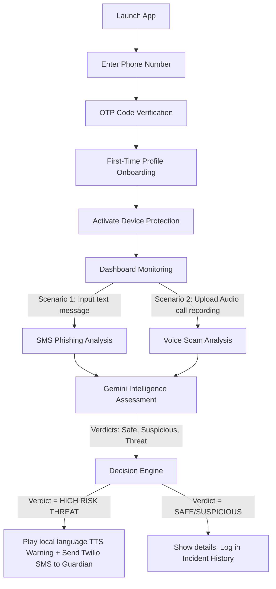

# Demo Guide & Test Scenarios - Kavach-AI

This document provides a walkthrough of the demo assets, test cases, and a presentation script for evaluating the **Kavach-AI** platform.

---

## 🗺️ Demo Flow Overview

The demo follows the standard user onboarding and real-time fraud mitigation workflow:

---

## 📝 Demo Script (3-Minute Presentation)

### Part 1: Problem & Intro (0:00 - 0:45)
> *"Hello! Every day, millions of people—especially elderly and vulnerable citizens—fall victim to voice phishing, banking scams, and malicious spam SMS. These attacks bypass traditional antivirus filters using social engineering in local languages. Introducing **Kavach-AI**—an intelligent, localized cybersecurity shield that acts as a digital armor for your devices, actively warning the user and notifying their trusted guardians when high-risk fraud is detected."*

### Part 2: Authentication & Onboarding (0:45 - 1:15)
> *"Let's open the application. When a user launches Kavach-AI, they are met with a secure phone verification portal powered by the Twilio Verify API. We enter a phone number and immediately receive a 6-digit OTP. 
> 
> Once verified, new users complete their Profile Setup. We link the device to the protected user's name, enter a trusted guardian's phone number, select a preferred warning audio language (e.g. Hindi), and set threshold preferences. When we click 'Save & Activate', the engine establishes local binds and displays a dynamic security activation sequence."*

### Part 3: Live Threat Scenarios (1:15 - 2:30)
> *"With Kavach-AI active, the engine monitors inputs. Let's run a test message analysis. We paste a common scam SMS containing a lottery reward hook. The translation engine translates it, Gemini Flash assesses the scam taxonomy, and renders a high-threat warning. Since the risk is critical, Kavach-AI immediately plays a localized voice warning in the preferred language to warn the user, and Twilio dispatches a real-time SMS alert directly to the registered guardian.
> 
> We can do the same for audio. We upload an audio snippet of a bank impersonator. The Sarvam Speech-to-Text API transcribes the audio, and Gemini flags it as high-threat financial scamming, triggering the voice warning and guardian SMS instantly. Everything is logged in the Incident History for auditable records."*

### Part 4: Conclusion & Future Scope (2:30 - 3:00)
> *"Kavach-AI provides an absolute safety net by combining real-time translation, generative AI intelligence, and active family notification. In the future, we aim to deploy local on-device small language models and intercept ongoing phone calls for zero-latency mitigation. Protect your family with Kavach-AI. Thank you."*

---

## 🧪 Demo Test Cases

Use these predefined test cases to demonstrate the translation, transcription, Gemini scoring, and Twilio alerting pipeline:

### Test Case 1: High Threat Phishing SMS (Text Analysis)
* **Input Text**: `प्रिय ग्राहक, आपका SBI योनो खाता ब्लॉक हो गया है। कृपया अपने विवरण को अपडेट करने के लिए तुरंत इस लिंक पर क्लिक करें: http://sbi-verify-kyc.net/login.php`
* **Translation Output**: `Dear customer, your SBI Yono account has been blocked. Please click on this link immediately to update your details: http://sbi-verify-kyc.net/login.php`
* **Gemini Assessment**:
  * **Risk Score**: `95/100`
  * **Risk Level**: `HIGH THREAT`
  * **Scam Type**: `Phishing / Impersonation`
* **Triggered Action**: Plays local language TTS audio warning (`hi-IN`) and sends alert SMS to the Guardian.

### Test Case 2: High Threat Lottery Scam (Audio Call Analysis)
* **Sample Audio Script (for recording or upload)**: *"हैलो, मैं कौन बनेगा करोड़पति से बात कर रहा हूँ। आपका मोबाइल नंबर २५ लाख रुपये की लॉटरी जीत गया है। इस पैसे को पाने के लिए आपको पहले टैक्स के तौर पर १०,००० रुपये इस खाते में ट्रांसफर करने होंगे।"* (Hello, I'm calling from KBC. Your mobile number won a 25 Lakh lottery. To get this money, you first need to transfer 10,000 as tax to this account.)
* **Transcription Output**: `हैलो, मैं कौन बनेगा करोड़पति से बात कर रहा हूँ। आपका मोबाइल नंबर २५ लाख रुपये की लॉटरी जीत गया है। इस पैसे को पाने के लिए आपको पहले टैक्स के तौर पर १०,००० रुपये इस खाते में ट्रांसफर करने होंगे।`
* **Translation Output**: `Hello, I am speaking from Kaun Banega Crorepati. Your mobile number has won a lottery of 25 lakh rupees. To get this money, you will first have to transfer 10,000 rupees as tax into this account.`
* **Gemini Assessment**:
  * **Risk Score**: `98/100`
  * **Risk Level**: `HIGH THREAT`
  * **Scam Type**: `Lottery Scam / Financial Advance-fee fraud`
* **Triggered Action**: Plays local language TTS audio warning (`hi-IN`) and sends alert SMS to the Guardian.

### Test Case 3: Suspicious/Unknown Request (Text Analysis)
* **Input Text**: `Hey, I am sending you a file package link, please download it to check the details: http://weird-domain.xyz/attachment-982.zip`
* **Gemini Assessment**:
  * **Risk Score**: `65/100`
  * **Risk Level**: `SUSPICIOUS`
  * **Scam Type**: `Malware / Unknown link`
* **Triggered Action**: Logs as suspicious, warns on screen, does not send SMS to guardian unless configured otherwise.

### Test Case 4: Safe Personal Conversation (Text Analysis)
* **Input Text**: `मम्मी, मैं कॉलेज पहुँच गया हूँ और मेरी क्लास शुरू होने वाली है। शाम को फोन करूँगा।` (Mom, I have reached college and my class is about to start. Will call in the evening.)
* **Translation Output**: `Mom, I have reached college and my class is about to start. Will call in the evening.`
* **Gemini Assessment**:
  * **Risk Score**: `5/100`
  * **Risk Level**: `SAFE`
  * **Scam Type**: `Legitimate`
* **Triggered Action**: Logs as safe on screen, no alert triggered.
